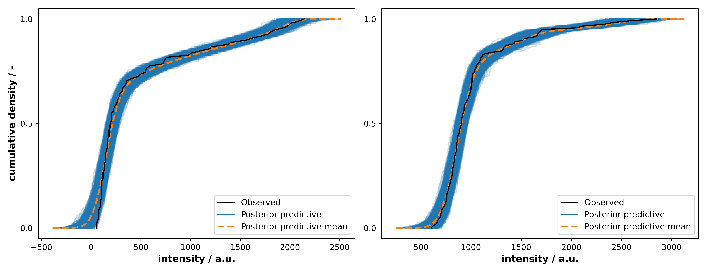

An important feature of $\texttt{PeakPerformance}$ is constituted by the easy access to diagnostic metrics for extensive quality control.
Using the data stored in an inference data object of a fit, the user can utilize the ArviZ package to generate various diagnostic plots.
One particularly useful one is the cumulative posterior predictive plot portrayed in Figure 1.
This plot enables users to judge the quality of a fit and identify instances of lack-of-fit.
As can be seen in the left plot, some predicted intensity values in the lowest quantile of the single peak example show a minimal lack-of-fit.
Importantly, such a deviation can be observed, judged and is quantifiable which intrinsically represents a large improvement over the status quo.

__Figure 1:__ Cumulative posterior predictive plots created with the ArviZ package and pertaining to the example data of the single His peak (left) and the double Leu and Ile peak (right). The empirical cumulative density function (black) is in good agreement with the median posterior predictive (orange) and lies within the predicted variance (blue band), visualizing that the model provides an adequate prediction irrespective of the intensity value.