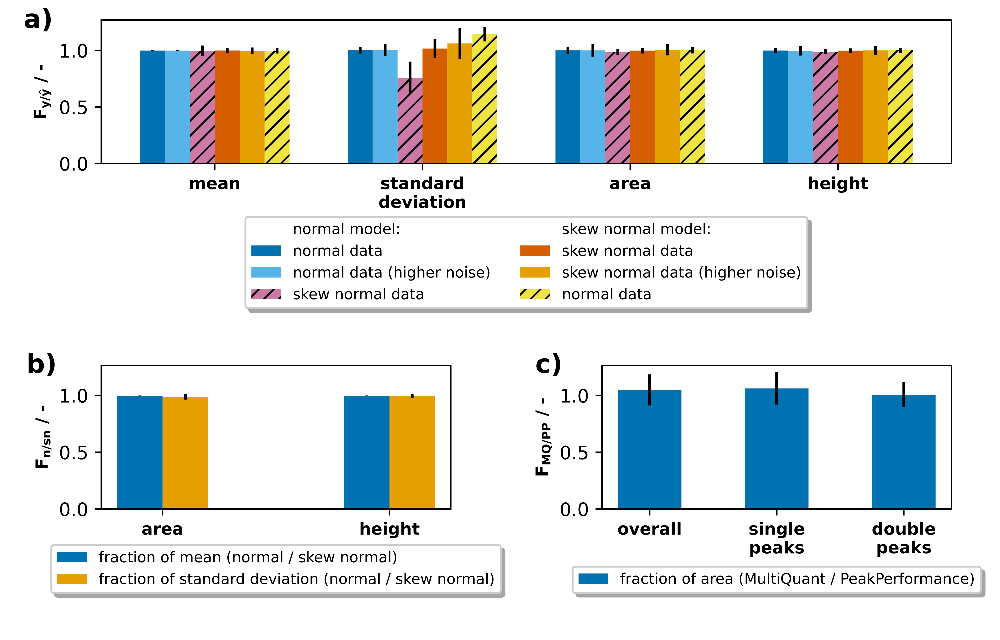

# Validation of `PeakPerformance`

## Materials and Methods
Several stages of validation were employed to prove the suitability of $\texttt{PeakPerformance}$ for chromatographic peak data analysis.
The goals were to showcase the efficacy of $\texttt{PeakPerformance}$ utilizing noisy synthetic data, to investigate cases where a peak could reasonably be fit with either of the single peak models, and finally to use experimental data to compare results obtained with $\texttt{PeakPerformance}$ to those from the commercial vendor software Sciex MultiQuant.

For the first test, 500 random data sets were generated with the NumPy random module [@harris2020array] by drawing from the normal distributions detailed in Table 1 except for the mean parameter which was held constant at a value of 6.
Subsequently, normally distributed random noise ($\mathcal{N}(0, 0.6)$ or $\mathcal{N}(0, 1.2)$ for data sets with the tag "higher noise") was added to each data point.
The amount of data points per time was chosen based on an LC-MS/MS method routinely utilized by the authors and accordingly set to one data point per 1.8 s.

__Table 1:__ Normal distributions from which parameters were drawn randomly to create synthetic data sets for the validation of $\texttt{PeakPerformance}$.

| **parameter**      | **model (1st test)**    | **model (2nd test)**    |
| ------------------ | ----------------------- | ----------------------- |
| area               | $\mathcal{N}(8, 0.5)$   | -                       |
| standard deviation | $\mathcal{N}(0.5, 0.1)$ | $\mathcal{N}(0.5, 0.1)$ |
| skewness           | $\mathcal{N}(0, 2)$     | -                       |
| baseline intercept | $\mathcal{N}(25, 1)$    | $\mathcal{N}(25, 1)$    |
| baseline slope     | $\mathcal{N}(0, 1)$     | $\mathcal{N}(0, 1)$     |

In marginal cases when the shape of a single peak had a slight skew, the automated model selection would at times settle on a normal or a skew normal model.
Therefore, it was relevant to investigate whether this choice would lead to a significant discrepancy in estimated peak parameters.
Accordingly, for the second test synthetic data sets were generated with the NumPy random module according to Table 1 and noise was added as described before.
The residual parameters were held constant, i.e. the mean was fixed to 6, the area to 8, and the skewness parameter $\alpha$ to 1.

For the third and final test, experimental peak data was analyzed with both $\texttt{PeakPerformance}$ (version 0.7.0) and Sciex MultiQuant (version 3.0.3) with human supervision, i.e. the results were visually inspected and corrected if necessary.
The data set consisted of 192 signals comprised of 123 single peaks, 50 peaks as part of double peaks, and 19 noise signals.

## Results and Discussion
In the first stage of validation, peak fitting with normal and skew normal peak models was tested regarding the ability to reproduce the ground truth of randomly generated noisy synthetic data sets.
The arithmetic means portrayed in Figure 1a were calculated based on a measure of similarity

$$\tag{12}F_{y / \hat{y}} = \frac{y}{\hat{y}}$$

where $y$ represents the estimated parameter value and $\hat{y}$ its pertaining ground truth.
As they exhibit values close to 1, this demonstrates a near identity between estimation and ground truth.
Additionally, the normal-shaped peak model was paired with skew normally distributed noisy data and vice versa.
In both cases, $\sigma$ was not reproduced well, especially by the normal-shaped model.
Nevertheless, the peak area and height were still identified correctly with the skew normal model and merely slightly underestimated by the normal model.

__Figure 1:__ Validation of results from $\texttt{PeakPerformance}$. **a)** Noisy synthetic data was randomly generated from one of the implemented distributions and the program's ability to infer the ground truth was observed. Portrayed are the fractions of estimated parameter to ground truth. **b)** The influence of model choice between normal and skew normal model in marginal cases with little to no skew was tested and the ratios between results from both models are plotted. **c)** Lastly, experimental data was analyzed with $\texttt{PeakPerformance}$ version 0.7.0 and compared to results achieved with the commercial software Sciex MultiQuant version 3.0.3.

In the second stage, marginal cases in the form of slightly skewed peaks were investigated to observe whether their estimation with a normal- or skew normal-shaped intensity function would result in significant differences in terms of peak area and height.
Here, a slight skew was defined as an $\alpha$ parameter of 1 resulting in peak shapes not visibly discernible as clearly normal or skew normal.
With a sample size of 100 noisy, randomly generated data sets, we show that nearly identical estimates for peak area and height, as well as their respective uncertainties are obtained regardless of the utilized model (Fig. 1b).
The exhibited mean values are based on fractions of the key peak parameters area and height between results obtained with a normal and skew normal model which were defined as

$$\tag{13}F_{n / \mathrm{sn}} = \frac{A_{\mathcal{N}}}{A_{\mathrm{skew \ normal}}}$$

where $A_{\mathrm{normal}}$ and $A_{\mathrm{skew \ normal}}$ are the estimated areas with normal and skew normal models, respectively.

In the third stage, experimental peak data was analyzed with both $\texttt{PeakPerformance}$ (version 0.7.0) and Sciex MultiQuant (version 3.0.3) and the fraction of the obtained areas was determined as

$$\tag{14}F_{\mathrm{MQ} / \mathrm{PP}} = \frac{A_{\mathrm{MQ}}}{A_{\mathrm{PP}}}$$

where $A_{\mathrm{MQ}}$ denominates the area yielded by MultiQuant and $A_{\mathrm{PP}}$ the area from $\texttt{PeakPerformance}$.
Beyond the comparability of the resulting peak area ratio means portrayed in Figure 1c, it is relevant to state that 103 signals from MultiQuant (54 % of total signals) were manually modified.
Of these, 31 % were false positives and 69 % were manually re-integrated.
These figures are the result of a relatively high share of double peaks in the test sample which generally give a lot more cause for manual interference than single peaks.
In contrast, however, the $\texttt{PeakPerformance}$ pipeline was only started once and merely two single peaks and one double peak were fit again with a different model and/or increased sample size after the original pipeline batch run had finished.
Among the 192 signals of the test data set, there were 7 noisy, low intensity signals without a clear peak which were recognized as a peak only by either one or the other software and were hence omitted from this comparison.
By showing not only the mean area ratio of all peaks but also the ones for the single and double peak subgroups, it is evident that the variance is significantly higher for double peaks.
In case of this data set, two low quality double peaks in particular inflated the variance significantly which may not be representative for other data sets.
It has to be stated, too, that the prevalence of manual re-integration of double peaks in MQ might have introduced a user-specific bias, thereby increasing the final variance.
Nevertheless, it could be shown that $\texttt{PeakPerformance}$ yields comparable peak area results to a commercially available vendor software.
