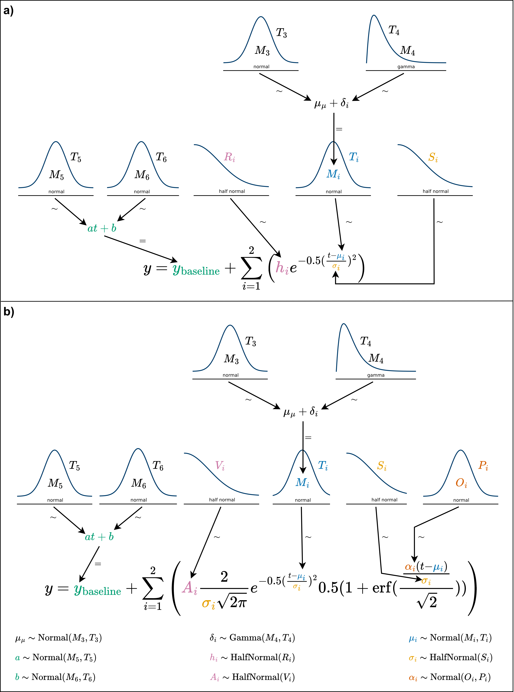

# Composition and assumptions of peak models

Peak models in $\texttt{PeakPerformance}$ require the definition of prior probability distributions (priors) for their parameters as well as the choice of an intensity function and a likelihood function.
Generally, priors are derived from a given time series and given a weakly informative parametrization, such that the resulting inferences of parameters like the peak height are primarily based on the data.
While defining priors in a data-dependent manner is generally to be avoided, it is clearly not tenable to define legitimate priors for all kinds of different peaks with heights and areas varying by multiple orders of magnitude and retention times, i.e. mean values, scattered across the whole run time of the LC-MS/MS method.
In order to flexibly build models for all these peaks in an automated manner and embedded in a standardized data pipeline, some parameter priors had to be based on the raw data.
If specific distributions or their parameters had to be restricted to certain value ranges, error handling was incorporated.
For example, when only positive values were acceptable or when 0 was not a permissive value, a lower bound was defined using NumPy's clip function.

Regarding shared model elements across all intensity functions, one such component of all models presented hereafter is the likelihood function

$$\tag{1}L \sim \mathcal{N}(y, \mathrm{noise})$$

with $y$ as the predicted intensity and $\mathrm{noise}$ as the free parameter describing the standard deviation of measurement noise.
This definition encodes the assumption that observed intensities are the result of normally distributed noise around the true intensity values of a peak.
In turn, the noise parameter is defined as

$$\tag{2}\mathrm{noise} \sim \mathrm{LogNormal}(\log_{10} \mathrm{max}(10, \mathrm{noise}_{\mathrm{guess}}), 1)$$

The log-normal distribution where the logarithm of the random variable follows a normal distribution was chosen partly to exclude negative values from the solution space and also due to its shape attributing a higher fraction of the probability mass to lower values provided the standard deviation is defined sufficiently high.
This prior is defined in a raw data-dependent manner as the $\mathrm{noise}_{\mathrm{guess}}$ amounts to the standard deviation of the differences of the first and final 15 % of intensity values included in a given time frame and their respective mean values.

The intensity function itself is defined as the sum of a linear baseline function and a peak intensity function, the latter of which is composed of a given distribution's probability density function (PDF) scaled up to the peak size by the area or height parameter.
The linear baseline

$$\tag{3}y_{\mathrm{baseline}}(t) = at+b$$

features the slope and intersect parameters $a$ and $b$, respectively, both of which were assigned a normally distributed prior.
The data-dependent guesses for these priors are obtained by constructing a line through the means of the first and last three data points of a given intensity data set which oftentimes already resulted in a good fit.
Hence, the determined values for slope ($a_{\mathrm{guess}}$) and intercept ($b_{\mathrm{guess}}$) are used as the means for their pertaining priors and the standard deviations are defined as fractions of them with minima set to 0.5 and 0.05, respectively.
Here, the exact definition of the standard deviations was less important than simply obtaining an uninformative prior which, while based on the rough fit for the baseline, possesses a sufficient degree of independence from it, thus allowing deviations by the Bayesian parameter estimation.

$$\tag{4}
    a \sim
    \begin{cases}
        \mathcal{N}(a_{\mathrm{guess}}, \frac{|a_{\mathrm{guess}}|}{5}) & \mathrm{if}\ \frac{|a_{guess}|}{5}\geq0.5\\
        \mathcal{N}(a_{\mathrm{guess}}, 0.5) & \mathrm{otherwise}\\
    \end{cases}
$$

$$\tag{5}
    b \sim
    \begin{cases}
        \mathcal{N}(b_{\mathrm{guess}}, \frac{|b_{\mathrm{guess}}|}{6}) & \mathrm{if}\ \frac{|b_{guess}|}{6}\geq0.05\\
        \mathcal{N}(b_{\mathrm{guess}}, 0.05) & \mathrm{otherwise}\\
    \end{cases}
$$

The initial guesses $\mathrm{noise}_{\mathrm{guess}}$, $a_{\mathrm{guess}}$, and $b_{\mathrm{guess}}$ are calculated from raw time and intensity by the  $\texttt{initial\_guesses()}$ function from the $\texttt{models}$ submodule.
Beyond this point, it is sensible to categorize models into single and double peak models since these subgroups share a larger common basis.
Starting with single peak models, the normal-shaped model (Figure 1a) requires only three additional parameters for defining its intensity function.

__Figure 1:__ The intensity functions of normal (**a**) and skew normal peak models (**b**) as well as the prior probability distributions of their parameters are shown in the style of a Kruschke diagram [@RN162]. Connections with $\sim$ imply stochastic and with $=$ deterministic relationships. In case of variables with multiple occurrences in one formula, the prior was only connected to one such instance to preserve visual clarity. The variables $M_{i}$ and $O_{i}$ describe mean values and $T_{i}$, $R$, and $S$ standard deviations.

The mean value $\mu$ has a normally distributed prior with the center of the selected time frame $\mathrm{min}(t) + \frac{\Delta t}{2}$ as its mean and $\frac{\Delta t}{2}$ as the standard deviation where $\Delta t$ corresponds to the length of the time frame.
Accordingly, the resulting prior is rather compressed and weakly informative.
The prior for the standard deviation of the normal-shaped peak model was defined with a half-normal distribution, once again to avoid values equaling or below 0.
As a half normal distribution only features a standard deviation, this was set to $\frac{\Delta t}{3}$.
The final parameter is the peak height used for scaling up the distribution to match the size of the peak.
Here, a rather uninformative half-normal distribution with a scale amounting to 95 % of the highest intensity value in the time frame was selected.

The second featured single peak model is based on the skew normal distribution (Figure 1b) which has an additional skewness parameter $\alpha$ enabling a one-sided distortion of the peak or resulting in identity to the normal-shaped peak model when $\alpha=0$.
Hence, the prior of $\alpha$ is constituted by a normal distribution centered on 0 with a standard deviation of 3.5 to allow for a sufficiently large range of possible values for $\alpha$ and thus a realistic skew.
Instead of the peak height, the peak area was utilized to scale the distribution, albeit with an identical prior.

The double peak models (Figure 2) featured many of the same variables as their single peak counterparts so only the differences will be highlighted here.

All variables pertaining to the actual peak were represented as vectors with two entries labeled with 0 and 1 by adding a named dimension to that effect.
Aside from that, their priors remained unaltered except for the peak mean $\mu$.

To provide a flexible solution to find double peak means across the whole time frame, the implementation of additional parameters proved indispensable.
More precisely, the mean of both peaks or group mean was introduced as a hyperprior (eq. 6) with a broad normal prior which enabled it to vary across the time frame as needed.

$$\tag{6}\mu_{\mu} \sim \mathcal{N}\biggl(\mathrm{min}(t) + \frac{\Delta t}{2}, \frac{\Delta t}{6}\biggr)$$

By defining a separation parameter representing the distance between the sub-peaks of a double peak

$$\tag{7}\mathrm{separation} \sim \mathrm{Gamma}\biggl(\frac{\Delta t}{6}, \frac{\Delta t}{12}\biggr)$$

the offset of each peak's mean parameter from the group mean is calculated as

$$\tag{8}\delta = \begin{bmatrix} - \frac{\mathrm{separation}}{2}\\\frac{\mathrm{separation}}{2}\end{bmatrix}$$

The priors for the mean parameters of each subpeak were then defined in dependence of $\mu_{\mu}$ and $\delta$ as

$$\tag{9}\mu = \mu_{\mu} + \delta$$

__Figure 2:__ The intensity functions of double normal (**a**) and double skew normal peak models (**b**) as well as the prior probability distributions of their parameters are shown in the style of a Kruschke diagram [@RN162]. Connections with $\sim$ imply stochastic and with $=$ deterministic relationships. In case of variables with multiple occurrences in one formula, the prior was only connected to one such instance to preserve visual clarity. The variables $M_{i}$ and $O_{i}$ describe mean values and $T_{i}$, $S_{i}$, $P_{i}$, and $V_{i}$ standard deviations.

While all aforementioned parameters are necessary for the models, not all are of equal relevance for the user.
A user's primary interest for consecutive data analysis generally lies in obtaining mean values, peak areas and perhaps - usually to a much lesser degree - peak heights.
Since only one of the latter two parameters is strictly required for scaling purposes, different models as shown in Figures 1 and 2 will feature either one or the other.
Nonetheless, both peak area and peak height should be supplied to the user, hence the missing one was included as a deterministic model variable and thus equally accessible by the user.
In case of the normal and double normal models, the peak height $h$ was used for scaling and the area $A$ was calculated by

$$\tag{10}A = \frac{h}{\frac{1}{\sigma\sqrt{2\pi}}}$$

For skew normal and double skew normal models, the scaling parameter was the peak area.
Since the mode and mean of a skewed distribution are – in contrast to normal distributions – distinct, the calculation of the height was nontrivial and ultimately a numerical approximation was added to the skewed models.

Beyond these key peak parameters, all PyMC models created by $\texttt{PeakPerformance}$ contain additional constant data variables, and deterministic model variables.
For example, the time series, i.e. the analyzed raw data, as well as the initial guesses for noise, baseline slope, and baseline intercept are kept as constant data variables to facilitate debugging and reproducibility.
Examples for deterministic model variables in addition to peak area or height are the predicted intensity values and the signal-to-noise ratio defined here as

$$\mathrm{sn} = \frac{h}{\mathrm{noise}}$$